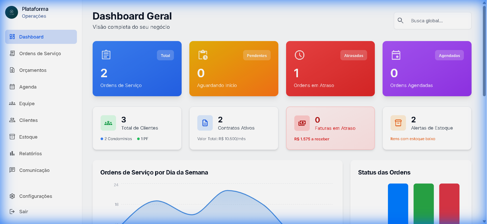
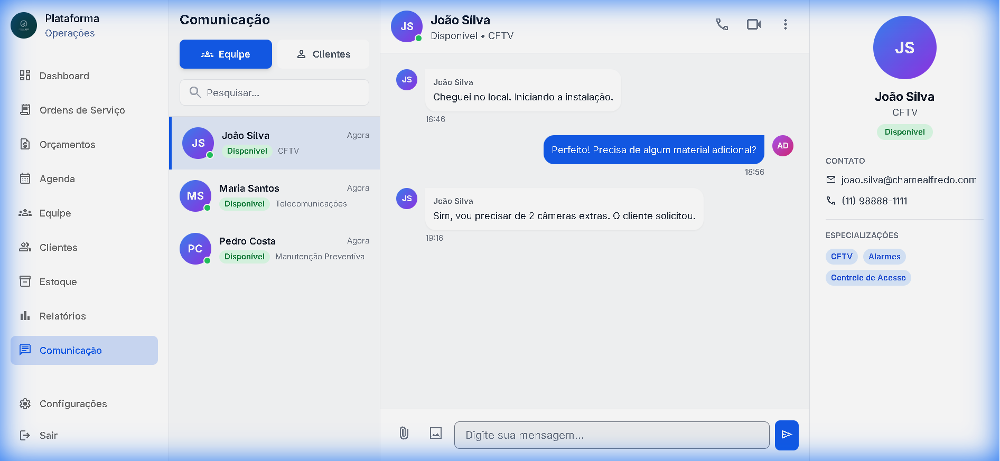
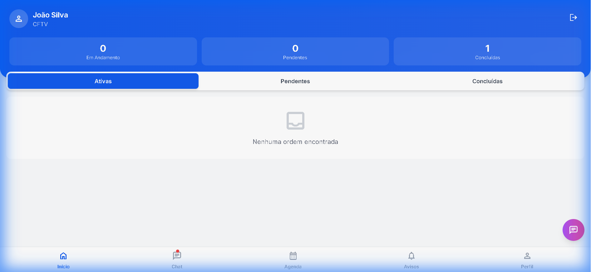
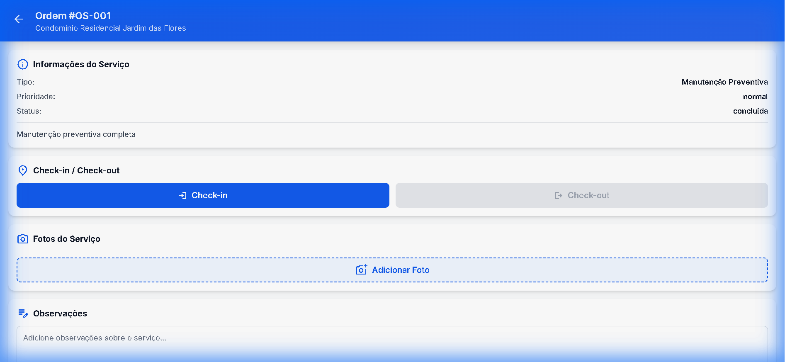

# 🛠️ Chame Alfredo - Plataforma de Gestão de Serviços

Bem-vindo ao **Chame Alfredo**, uma solução completa e moderna para gestão de empresas de prestação de serviços, manutenção e assistência técnica. O sistema é composto por um **Painel Administrativo Web** e um **Aplicativo Mobile para Técnicos**.

---

## 🚀 Funcionalidades Principais

### 🖥️ Painel Web (Administrativo)

O centro de comando para gestores e administradores.

*   **📊 Dashboard Inteligente**:
    *   Visão geral de ordens (Pendentes, Em Andamento, Atrasadas).
    *   Métricas financeiras e de contratos.
    *   Alertas de estoque baixo e faturas em atraso.
    *   Gráficos interativos de desempenho semanal e distribuição de clientes.
*   **👥 Gestão de Clientes (CRM)**:
    *   Cadastro completo de Pessoas Físicas e Jurídicas (Condomínios).
    *   Histórico de serviços e contratos por cliente.
    *   Identificação visual de status e tipo de cliente.
*   **📝 Ordens de Serviço (OS)**:
    *   Visualização em Lista ou Kanban (Arrastar e Soltar).
    *   Ciclo de vida completo: Nova -> Agendada -> Em Andamento -> Concluída.
    *   Priorização visual (Urgente, Alta, Normal).
*   **📄 Contratos Recorrentes**:
    *   Gestão de contratos de manutenção mensal.
    *   Controle de pagamentos e renovações automáticas.
*   **📦 Controle de Estoque**:
    *   Gestão de itens, peças e equipamentos.
    *   Alertas automáticos de nível mínimo.
*   **💬 Central de Comunicação**:
    *   Chat em tempo real com técnicos em campo.
    *   Monitoramento de status da equipe (Online, Em Serviço, Offline).
    *   Histórico de mensagens com clientes.

### 📱 Aplicativo Mobile (Técnico)

Ferramenta poderosa para a produtividade da equipe em campo.

*   **📅 Agenda Digital**:
    *   Visualização clara dos compromissos do dia e do mês.
    *   Detalhes completos do serviço e cliente.
*   **📍 Execução de Serviço**:
    *   **Check-in/Check-out** com geolocalização.
    *   **Upload de Fotos** do serviço (Antes/Depois).
    *   **Assinatura Digital** do cliente na tela.
*   **🔔 Central de Notificações**:
    *   Avisos de novas ordens, alterações e mensagens.
*   **💬 Chat Integrado**:
    *   Comunicação direta com a base administrativa.
    *   Botão de acesso rápido flutuante.
*   **👤 Perfil e Desempenho**:
    *   Métricas individuais (Taxa de conclusão, serviços realizados).
    *   Acesso a relatórios de produtividade.

---

## 🔑 Credenciais de Acesso (Demonstração)

Utilize as credenciais abaixo para testar todas as funcionalidades do sistema.

### 🖥️ Acesso Web (Admin)
*   **URL**: `http://localhost:3000`
*   **Email**: `admin@admin.com` (Autenticação simulada)
*   **Senha**: `admin` (ou qualquer senha para teste)

### 📱 Acesso Mobile (Técnico)
*   **URL**: `http://localhost:3000/#/mobile/login`
*   **Usuário**: `joao.silva`
*   **Senha**: `tecnico123`

> **Nota**: O sistema utiliza `localStorage` para persistência de sessão. Para testar diferentes perfis, utilize a opção "Sair" ou limpe os dados do navegador.

---

## 🛠️ Tecnologias Utilizadas

*   **Frontend**: React 18, TypeScript, Vite
*   **Estilização**: Tailwind CSS (Design System Premium)
*   **Gráficos**: Recharts
*   **Ícones**: Material Symbols & Lucide React
*   **Roteamento**: React Router DOM
*   **Gerenciamento de Estado**: React Context API

---

## 📸 Galeria de Telas

### Dashboard Web
Visão geral com métricas de faturamento, ordens e alertas.


### Comunicação Web
Chat integrado com monitoramento de equipe em tempo real.


### Dashboard Mobile
Interface do técnico com acesso rápido a ordens e chat.


### Execução de OS Mobile
Detalhes da ordem, checklist, fotos e assinatura.


---

## 🚀 Como Rodar o Projeto

1.  **Instalar dependências**:
    ```bash
    npm install
    ```

2.  **Rodar servidor de desenvolvimento**:
    ```bash
    npm run dev
    ```

3.  **Acessar no navegador**:
    *   Abra `http://localhost:3000`

---

Desenvolvido com ❤️ por **Antigravity** para **Chame Alfredo**.
