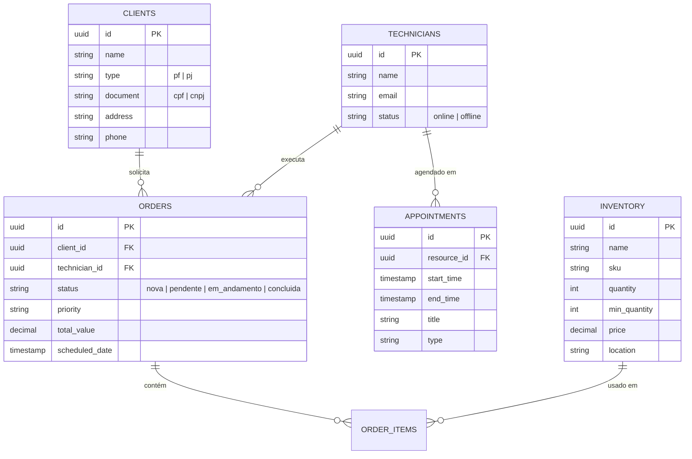

# 💾 Modelo de Dados

Estrutura do banco de dados PostgreSQL gerenciado pelo Supabase.

## Diagrama de Entidade-Relacionamento

---

## Dicionário de Tabelas

### 1. `orders` (Ordens de Serviço)
Tabela central do sistema. Armazena o ciclo de vida do serviço.
*   **status**: Controla o fluxo de trabalho (Kanban).
*   **priority**: Define a urgência visual no dashboard.

### 2. `inventory` (Ativos)
Catálogo de peças e equipamentos.
*   **min_quantity**: Gatilho para alertas de "Estoque Baixo".
*   **sku**: Código único de identificação para busca rápida.

### 3. `appointments` (Agenda)
Nova tabela para suporte ao módulo "Command Center".
*   Permite alocação de tempo sem necessariamente criar uma OS completa.
*   Sincronizada com a visualização de calendário.

### 4. `technicians` & `clients`
Cadastros de pessoas. No futuro, `technicians` será vinculado à tabela `auth.users` do Supabase para gestão de login seguro.
